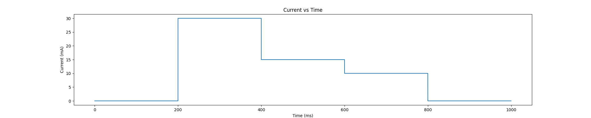
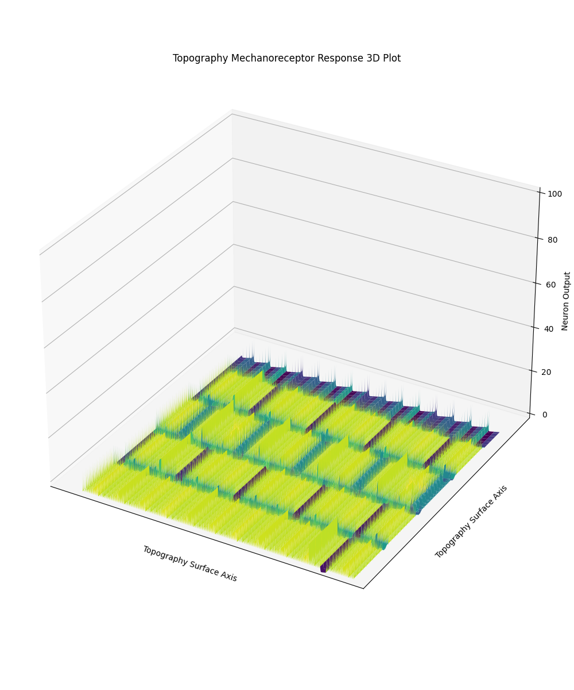

# Mechanoreceptor-Model
Model of Human Mechanoreceptor Response to Topographical Stimuli

# receptor_response_test.ipynb
Main file containing all mechanoreceptor models

## 1. Basic Model
This cell in **receptor_response_test.ipynb** takes in a single current input over 1 second, and
outputs the response from the mechanoreceptor model

### Input

### Output

## 2. Scanning Model
This model again assumes that surface texture height can be interpreted as current, but mimics a
horizental strip of sensors scanning across the topography surface.

The values of heigh in an entire row (100 indices) is scaled to 100000 indices in a newer array for
greater resolution, and is used as input into the basic model. This is repeated over the 100 rows in
the topograhy array. The 100 outputted mechanoreceptor response is displayed in the graphs both as a
heat map and 3D plot.

### 3D Text Example
#### Input

#### Heatmap Output

#### 3D Plot Output

### Surface Texture Example
#### Input
This input texture was translated to a 2D array

#### Heatmap Output

#### 3D Plot Output

### Keyboard Example
#### Input

#### Heatmap Output

#### 3D Plot Output

## 3. Static Model
This uses the functionality form the Basic Model and applies it to an array of currents.

This cell uses a 2D array generated from an image, where the axes are the surface (top-down view),
and the values are the "height" of the surface. It assumes that the height of the surface can also
be interpreted as current response from the pressure of a height change onto the sensor.

The model is run for every index in the array, and the number of spike is saved for every cell.
This is saved to another 2D array, with values of  spike counts for every index from the original
topograhy array.

This spike count array is used to display the frequency response at each index, with higher
frequencies outputting a higher value on the z-axis on the 3D plot. This is a representation of the
encoding of the surface texture. When a finger scans over a texture, the more pressure that is
experienced by the mechanoreceptors, the faster the fire rate of action potentials, therefore
encoding the surface texture information to the brain.
